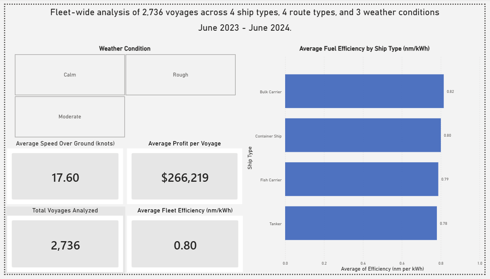
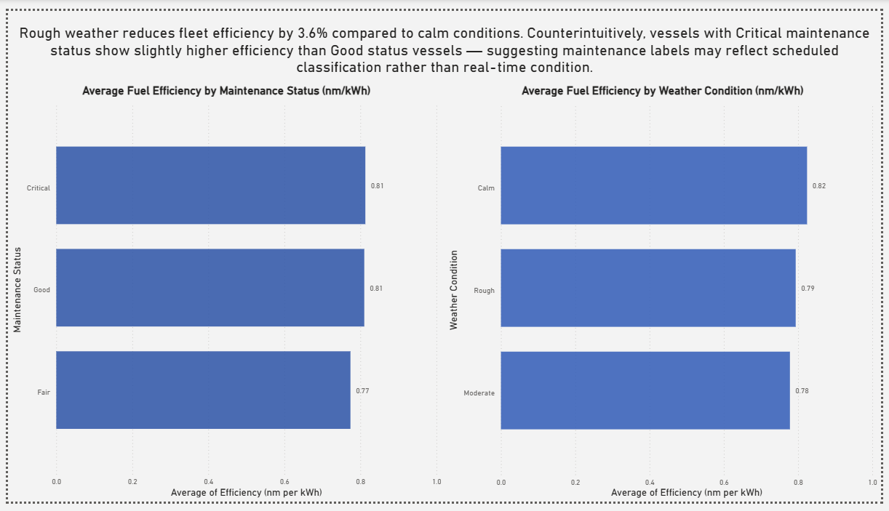
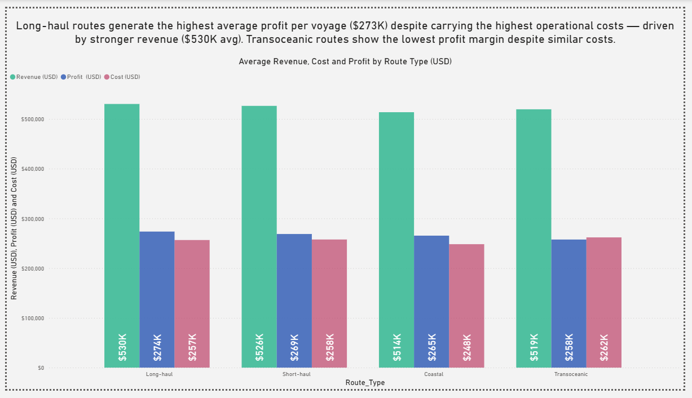
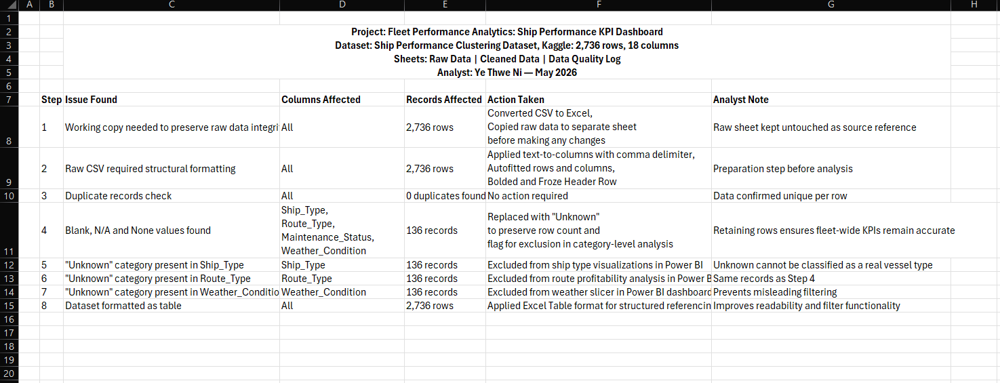
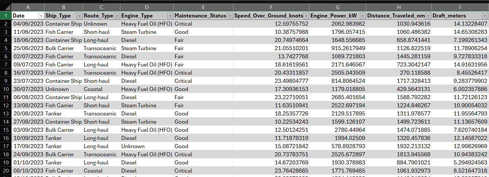
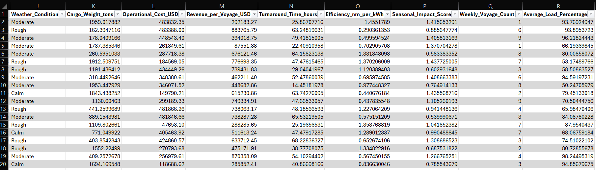
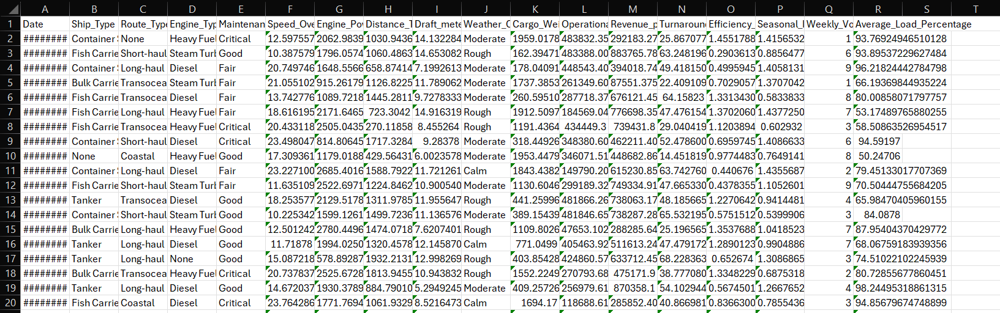

# Fleet Performance Analytics — Ship Performance KPI Dashboard

## Business Question
Which factors most significantly impact fuel efficiency and voyage
profitability across a global shipping fleet?

## Project Overview
This project analyzes 2,736 vessel voyages from a global shipping
fleet covering June 2023 to June 2024. The analysis focuses on
fuel efficiency, operational costs, and route profitability across
4 ship types, 4 route types, and 3 weather conditions.

## Tools Used
- Microsoft Excel — data cleaning, structural formatting,
  data quality documentation
- Microsoft Power BI — KPI dashboard and data visualization

## Dataset
- Source: Ship Performance Clustering Dataset (Kaggle)
- Records: 2,736 voyages
- Columns: 18
- Period: June 2023 – June 2024

## Data Quality
- 0 duplicate records found
- 136 records contained blank, N/A or None values across
  Ship_Type, Route_Type, Maintenance_Status and Weather_Condition
- Missing values replaced with "Unknown" to preserve row count
- Unknown records excluded from category-level visualizations
  but retained in fleet-wide KPI calculations
- Full data quality log documented in Excel file

## Key Findings
1. Rough weather reduces fleet fuel efficiency by 3.6% compared
   to calm conditions (0.795 vs 0.825 nm/kWh)
2. Tankers are the least fuel-efficient ship type (0.78 nm/kWh)
   and generate the lowest average profit per voyage ($252K)
3. Long-haul routes generate the highest average profit per
   voyage ($273K) despite carrying the highest operational costs,
   driven by stronger revenue ($530K avg)
4. Counterintuitively, vessels with Critical maintenance status
   show marginally higher efficiency than Good status vessels —
   suggesting maintenance labels may reflect scheduled
   classification rather than real-time vessel condition

## Dashboard Pages
- Page 1 — Fleet Overview: KPI summary across 2,736 voyages
- Page 2 — Efficiency Analysis: weather and maintenance impact
  on fuel efficiency
- Page 3 — Route Profitability: revenue, cost and profit
  breakdown by route type

## Dashboard Preview

### Page 1 — Fleet Overview

### Page 2 — Efficiency Analysis

### Page 3 — Route Profitability

## Data Preview

### Data Quality Log

### Cleaned Data

### Raw Data

## Project Files
- [Fleet Performance Dashboard (PDF)](dashboard/Fleet_Performance_Analysis.pdf)
- [Fleet Performance Dataset (Excel)](data/Fleet_Performance_Analysis.xlsx)

## Author
Ye Thwe Ni — Digital Business and Data Science Student
University of Europe for Applied Sciences, Hamburg
May 2026
